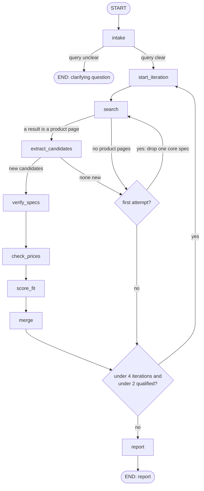

# Architecture

The agent is a LangGraph `StateGraph` built in `graph.py` (`build_graph()`). One run takes a shopping query through intake, up to 4 search iterations and a final report. A candidate **qualifies** when its required specs were found, it has a verified price within budget, and its fit score is 7 or more. The run stops early once 2 candidates qualify.

The two diamonds are routing functions, not nodes: `_retry_search_or_move_on` and `route_next_iteration`.

## Nodes

- **intake**: checks that the query states a use case and a budget, then turns it into non-negotiable and negotiable specs. Uses Call A (clarity check), then Call B (requirements); stops with a question if the query is unclear.
- **start_iteration**: increments the iteration counter and resets the search attempt. No LLM call.
- **search**: Tavily search restricted to 6 Indian retailers. The query is the category, plus the user's own words from their request (filler and budget amounts removed), plus a keyword rewrite of the specs by an LLM call in `tools.py` once per iteration, adding up to 2 negotiable specs in iterations 1–2. Attempt 2 reuses that query with one core spec's words removed, never the user's own words.
- **extract_candidates**: pulls distinct products and their visible specs from the results with Call C. Then drops products whose URL isn't in the results or isn't a product page, dedupes by URL or model number, and records each candidate's model numbers.
- **verify_specs**: for candidates missing specs, runs a spec-site search and Call D, skipping Call D when the search is empty. Then sets `specs_found` by comparing keys case-insensitively.
- **check_prices**: tries the search snippet, then page extraction, then a fallback retail search. Keeps only ₹ amounts that sit next to the candidate's own model number or name and fall within 0.25–3× the budget; Call E picks the selling price among those amounts.
- **score_fit**: Call F gives a 1–10 fit score, reasoning, and the missing or weak specs.
- **merge**: dedupes the iteration's candidates into `all_candidates`. No LLM call.
- **report**: ranks candidates (verified in budget, verified over budget by gap, then unpriced; max 4) and builds the Final Recommendation headline in Python. Then writes the Markdown report with the report LLM call.

## Streaming

`agent.run_pipeline_stream()` runs `graph.stream(stream_mode=["updates", "messages", "custom"])` and yields:
- `progress` events: node progress text, plus Groq rate-limit waits sent with `get_stream_writer`;
- one `headline` event: the Python-built recommendation sentence;
- `token` events: report-node text only, never reasoning or other nodes' output;
- a last `final` event carrying the `run_pipeline()` result.

`app.py` writes progress inside `st.status` and streams the tokens with `st.write_stream`.

## Files

- `app.py`: Streamlit chat UI; calls `agent.run_pipeline()`.
- `agent.py`: `run_pipeline()` (invokes the compiled graph) and `run_pipeline_stream()` (streams it), both shaping the result for the UI.
- `graph.py`: state schema, nodes, routing functions and `build_graph()`.
- `tools.py`: Tavily search/extract wrappers, URL and listing filters, model-number parsing, price attribution, retries (`invoke_with_retry`), report ranking and headline.
- `prompts.py`: Groq models, structured-output schemas, prompts for Calls A–F and the report, and the intake chain.
- `test_graph.py`: runs one live query, printing each node; saves report, summary and token counts per call type to `runs/`.
- `tests/`: mocked unit tests (`python -m unittest discover -s tests`); no Groq or Tavily calls.

## Known limitations

- **Price coverage**: many candidates end up "price unverified". Retail pages often render prices client-side or list other products' prices next to them, and the agent only accepts a price it can tie to the exact product.
- **RunnableBranch error fallback**: in `prompts.py`, an unexpected Call A status (or a missing question) returns an `{"error": ...}` dict or `None` instead of raising. `intake` stores that as the requirements, and the run fails later with a KeyError or TypeError.
- **Shared `search_tool.max_results`**: the search node changes the module-level `search_tool` in place, so concurrent runs would interfere.
- **No checkpointer yet**: `build_graph()` accepts one but none is used, so a run's state can't be resumed or inspected after it ends.
