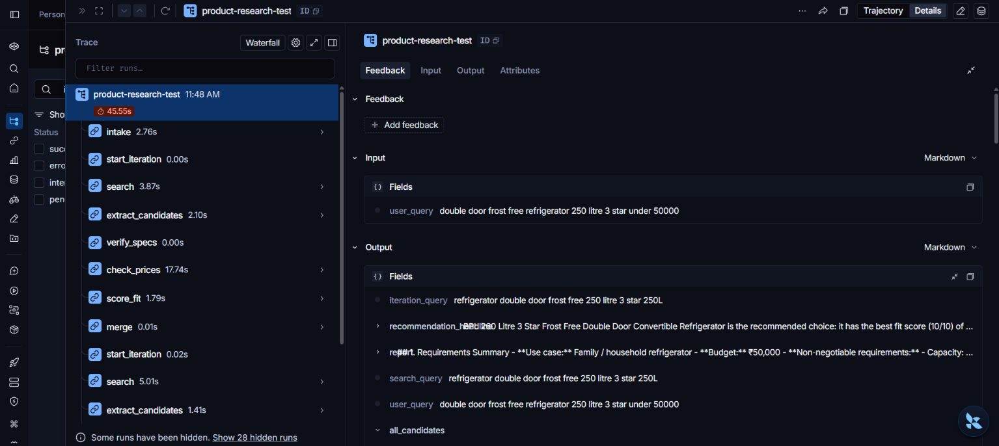
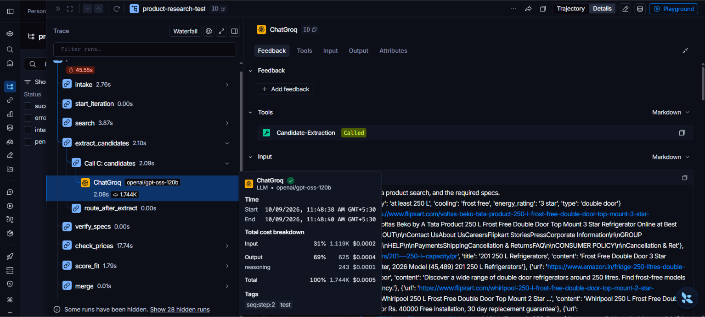

# Indian Market Product Research Agent

Tell it what you want to buy and your budget — it searches real Indian retail sites, verifies actual product specs and prices, and gives you a structured comparison with a final recommendation. No hallucinated products, no made-up prices.

**Try it live:** [shopping-research-agent.streamlit.app](https://shopping-research-agent.streamlit.app/)

---

## What it does

You type something like _"I want a laptop for coding, budget around 50000 INR"_ and the agent:

1. **Understands what you need** — turns "laptop for coding" into real technical requirements (processor, RAM, storage, etc.), and asks a follow-up question if your budget or use case is missing.
2. **Searches Indian retail sites** — Amazon.in, Flipkart, Croma, Reliance Digital, and more.
3. **Extracts real product specs** from the search results — only for products it can actually verify exist in the results, never invented ones.
4. **Fills in missing specs** with a targeted follow-up search, checking spec-aggregator sites for the full picture.
5. **Finds a verified price** from the search-result snippet, the product page itself, or a fallback search across other Indian retailers. Each price is checked to belong to that exact product (its model number or name appears next to the amount) and to be plausible for the budget; if none can be confirmed, the product is shown as "price unverified".
6. **Scores each product** against your requirements and budget.
7. **Searches again with progressively simpler queries** — up to 4 iterations, stopping early once 2 products qualify. Iterations 1–2 add a couple of nice-to-have preferences to the query, iterations 3–4 use only the must-have specs, and a retry within an iteration drops one core spec from the query. This loosening follows the iteration count, not the budget results.
8. **Writes a full report** once it has enough good options (or runs out of attempts) — requirements summary, comparison table, fit scores with reasoning, and a final pick.
9. **Is honest when nothing fits** — if no product matches your budget, it explains the gap and suggests a realistic budget or which requirement to relax, instead of failing silently.

In the app you see each step's progress live while it works (including any wait for the AI service's rate limit), and the report streams in as it is written, after its one-line recommendation.

Every search is saved: the sidebar lists your past searches, newest first, and clicking one reopens its report read-only, without running the search again (each has a delete button). History lives in a local SQLite file (`data/agent.db`), so on Streamlit Community Cloud it resets whenever the app restarts or is redeployed.

**Tip:** specific requests work best — for example _"double door frost free refrigerator 250 litre 3 star under 50000"_ — because vague queries often return only category pages instead of individual products.

---

## Why this was harder than it sounds

The real challenge wasn't calling an LLM — it was making sure it didn't lie. Early versions of this agent confidently invented product names, specs, and prices that didn't exist anywhere in the search results. A lot of the actual engineering here is safeguards, not features:

- Every recommended product's source is cross-checked against the raw search results — if the LLM claims a product came from a URL that was never actually in the results, it gets dropped.
- Listing and search-result pages get filtered out before they can be mistaken for real, individual products.
- Prices come from search snippets, page extraction or a fallback search, and each one is checked to belong to the product (model number or name next to the amount, a price within a plausible range of the budget) — never guessed. When no price can be confirmed, the report says "price unverified" and never recommends that product as the pick.
- The report-writing step is explicitly told to say "not listed" rather than fill in gaps with plausible-sounding guesses.

None of these are perfect, but together they make the agent's output something you can actually trust more than a single unverified LLM response.

---

## Tech stack

| Piece                            | What it's for                                                                 |
| -------------------------------- | ----------------------------------------------------------------------------- |
| **LangGraph**                    | Runs the agent as a state graph: a node per step, edges for retries and loops |
| **LangChain**                    | Prompts, structured outputs, and the Groq/Tavily integrations                 |
| **Groq** (`openai/gpt-oss-120b`) | Powers requirement extraction, spec verification, scoring, and report writing |
| **Tavily**                       | Web search and page extraction for real product data                          |
| **Streamlit**                    | The chat interface                                                            |

---

## Running it locally

```bash
git clone https://github.com/HetviThakkar-025/Product-Research-Agent.git
cd Product-Research-Agent
python -m venv venv
venv\Scripts\activate      # Mac/Linux: source venv/bin/activate
pip install -r requirements.txt
```

Create a `.env` file in the project root with your own API keys (`.env.example` lists every setting):

```
GROQ_API_KEY=your_key_here
TAVILY_API_KEY=your_key_here
GROQ_MODEL=openai/gpt-oss-120b   # optional, defaults to openai/gpt-oss-120b
```

Then run:

```bash
streamlit run app.py
```

---

## Observability with LangSmith

Tracing is optional and off by default. To turn it on, add these to `.env`:

```
LANGSMITH_TRACING=true
LANGSMITH_API_KEY=your_langsmith_key
LANGSMITH_PROJECT=product-research-agent   # optional, this is the default
```

Without `LANGSMITH_API_KEY`, tracing stays off and the app runs exactly as before. The tests never send traces.

Each search becomes one trace named `product-research`, tagged `streamlit` (or `test` for `test_graph.py` runs), with the thread_id and the first 100 characters of the query as metadata. Inside it you see each graph node (intake, search, extract_candidates, ...), the routing decisions (for example `route_after_search` sending a search without product pages back to `search`, skipping Call C), every LLM call by name (`Call A: clarify` to `Call F: fit`, `Search query rewrite`, `Report`) with its prompt, output, tokens and latency, the Tavily searches, and any `Groq rate-limit wait`.


*The step tree for one search: each graph node with its timing.*


*A single LLM call (`Call C: candidates`) with its input, output and token counts.*

A trace contains your query, the prompts, the search results and page text, and the model outputs. API keys are not included.

---

## Testing

```bash
python -m unittest discover -s tests
```

The tests mock every Groq and Tavily call, so they need no API keys and use no quota. To try one real query end to end, run `python test_graph.py "I want a laptop for coding under 60000"`; it prints each step and saves the report and a summary under `runs/`.

---

## Project structure

```
app.py        # Streamlit chat interface
agent.py      # run_pipeline() entry point used by app.py (runs the graph)
graph.py      # LangGraph state graph: the nodes and routing of the 9-step flow
tools.py      # Search, filtering, and verification utilities
prompts.py    # LLM prompts and structured output schemas
storage.py    # SQLite persistence: LangGraph checkpoints + the past-searches table
tracing.py    # LangSmith tracing switch (env vars only, off without an API key)
data/agent.db # Saved searches (created on first run, gitignored)
test_graph.py # Runs one live query, printing each node; saves report + summary to runs/
tests/        # Mocked unit tests (no API calls)
```

---

## A few honest limitations

- **Price coverage is the main limitation.** Retail pages often render prices client-side or mix in other products' prices (carousels, "similar items"), and the agent only accepts a price it can tie to the exact product — so many candidates end up "price unverified", and in recent laptop test runs only a few of the candidates found had a verified price.
- Runs on free-tier API limits, so it may occasionally hit daily usage caps under heavy traffic — you'll see a clear message if that happens, not a crash.
- Search quality varies by product category — tested most heavily on laptops, with good results on appliances too, but some categories may need a few tries to find good matches.
- Not connected to live pricing APIs, so prices are as current as the last time Tavily indexed that page — always worth double-checking on the actual retailer site before buying.
- Search history is kept only in a local SQLite file — no external database — so on Streamlit Community Cloud past searches are lost when the app restarts or is redeployed. Reopened searches are read-only; follow-up questions on them aren't supported yet.

## Known issues

- Specs you state are sometimes treated as preferences rather than requirements, so a product that misses one can still be listed.
- Review pages can occasionally pass as product pages.
- Price coverage depends on search snippets: when a retailer's snippet doesn't show the price, the product usually ends up "price unverified".
